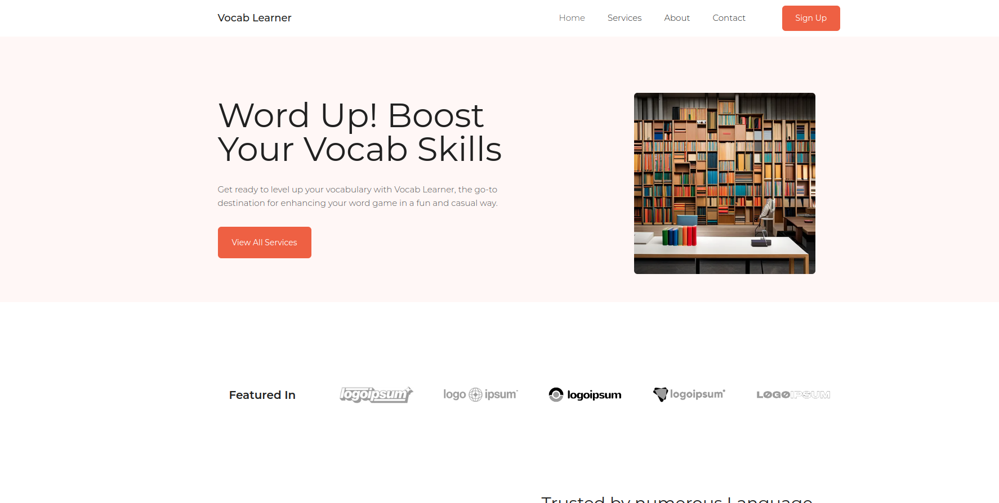

# Vocabulary Trainer

This repository holds my first real project in the Django-Universe.
For now, the database contains one word and a rather elaborate combination of models.

These models are the following

## AbstractWord model:

This model represents an abstract word, which serves as a common ground for other words. It contains two fields: word_id and abstract_word.
Fields and one __str__ method:
1. word_id: A primary key field using models.BigAutoField, which means it automatically generates a unique identifier for each instance of the model.
2. abstract_word: A character field (models.CharField) with a maximum length of 100 characters. It represents the English version of the abstract word.
3. __str__ method: This method defines how the object should be represented as a string. It combines word_id and abstract_word to create a human-readable representation.
Language model:

## Language
This model represents the languages that are supported for translations, it only contains one field and the __str__ method:
name: A character field (models.CharField) with a maximum length of 30 characters. It stores the name of the language.
__str__ method: This method defines how the object should be represented as a string. It returns the name of the language.
Word model:

## Word 
This model represents the translated representations of each AbstractWord. It associates a word in a specific language with its corresponding abstract concept.
It contains  four fields and the __str_method:
1. word: A foreign key field (models.ForeignKey) linking to the AbstractWord model. It establishes a one-to-many relationship between Word and AbstractWord. Each Word instance is associated with one specific AbstractWord.
2. language: A foreign key field (models.ForeignKey) linking to the Language model. It establishes a one-to-many relationship between Word and Language. Each Word instance is associated with one specific Language.
3. text: A character field (models.CharField) with a maximum length of 100 characters. It stores the word in the language being represented.
4. definition: A character field (models.CharField) with a maximum length of 100 characters. It can be used to store the definition or meaning of the word in the specified language.
5. __str__ method: This method defines how the object should be represented as a string. It combines word, language, text, and definition to create a human-readable representation.

# Technologies used
1. Django
2. CSS
3. HTML
4. minimal Javascript and JQuery
## Summary

The AbstractWord model serves as a base model for abstract words (in English). Other models can use the AbstractWord model as a foreign key to represent a concept with more specific details.
Via the Language model support for new languages can be implemented. It is not directly linked to the AbstractWord model but is linked to the Word model, allowing each word to be associated with a specific language.
The Word model links to both the AbstractWord and Language models through foreign key relationships, establishing a connection between an abstract concept and its translated representations in different languages.
By separating these models, the Site will not contain an artificial language barrier. Adding support for another language is as simple as adding it in the field in the admin-backend.

## To Do
I will shortly outline what's missing for the app to be usable. You will realise this upon copying and running :-)

1. An actual responsive frontend - I aim for something along these lines:
 
2. Advanced backend-logic
    * User-model
      * progress tracking
      * high score
    * ~~randomised word view~~
    * ~~a listview that only gives the word in a specified language~~
3. A functionality to upload many words at once. Doing so manually is a tedious task

